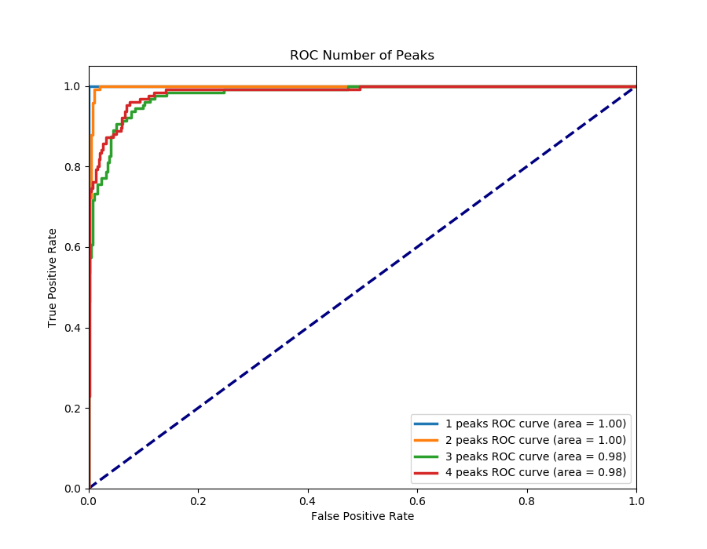

# NASA: DATA Capstone
DATA-451

**Steven Bradley, Nathan Philliber, Mateo Ibarguen**

## Installation
In order to execute these scripts, you will need to have at least `python3.6` installed and all the [dependencies](requirements.txt).

### Virtual Environment *(Suggested Installation)*
It is suggest to use a virtual environment rather than your system's python installation. This way there won't be conflicts between different versions or any other project you have on your machine. In addition, if you wish to use GPU training, it is required to use a virtual environment.

From the root of the project directory, create a virtual environment with the following command:
```
python3.6 -m venv .
```
This will create a virtual environment named `venv` in the project directory. If you name the directory `venv` then it will already be in the .gitignore.

To use the virtual environment, use the following command from the root of the project directory:
```
source venv/bin/activate
```
Now when you run scripts using `python`, the virtual environment will be used. 

### Matlab Configuration *(Required for Data Generation)*
The data generation scripts use Matlab's engine to create the spectra data. Thus, Matlab is required to already be installed on your machine if you wish to generate data. If Matlab is installed, then we just have to setup a path variable to tell Python where it is.

1. Find your Matlab installation. The easiest way to find your Matlab installation is to open Matlab executable and view it in-app. 
      In Matlab, navigate to command window and enter command: `matlabroot`. Save the printed string for later. Close Matlab.
   
2. Navigate to `<matlabroot>/extern/engines/python` and run the following command:
      ```
      sudo python3 setup.py install --prefix="<ProjectRoot>/venv"
      ```
      Where `<ProjectRoot>` is the location of the project directory.
      
      If you are not using a virtual environment, you can omit the `--prefix` argument.
     
2. Run the following command:
      ```
      sudo apt-get install python3-tk
      ```
   
3. Assuming you have created a virtual environment `./venv/`, open the following file in a text editor. 
      - Open `./venv/bin/activate`
      - Add the following line to the end of the file:
        ```
        export PYTHONPATH="${PYTHONPATH}:<MatlabRoot>"
        ```
        Replace `<MatlabRoot>` with the string we saved earlier.

   No virtual environment: just run the command or add the line above to your ~/.bash.rc or similar. 
   
4. Now we need to install the dependencies listed in `./requirements.txt`.
   If you have a virtual environment, activate it with:
    ```
    source venv/bin/activate
    ```
   Then install the dependencies with: 
   ```
   python -m pip install -r requirements.txt
   ```
   
Now you're ready to go!


## Quickstart
In order to execute these scripts, you will need to have at least `python3.6` installed and all the [dependencies](requirements.txt).

We added an example dataset and a pre-trained model in order to demonstrate how our project works. When you are asked to select a dataset, make sure to select: `example_set`. When prompted to select a model, make sure to select: `GoogleModel_BC-1234-50c-all.0513.2202` 
```bash
source virtualenv/bin
```

- In order to train the model with the additional example dataset, type the following:
```
python3 -m models.run_train continue
```
- In order to evaluate the model with the example dataset, type the following:
```
python3 -m models.run_train evaluate
```



## Docker Instructions
--
1. ssh into AWS server
2. cd to top-level source code directory
3. Build the Docker image via `./docker_rebuild.sh`. This will create a Docker image named: `nasa/peak_detection:latest`.
4. Now that the image exists, you should be able to execute Python code by running the following: `./run_docker.sh <python_script> <args>`

## S3 Integration
Due to the size of the datasets that are generated, we implemented a way for the datasets to be stored in S3 rather than on disk. If this is something that you would like to use, please contact us with your AWS account number and we can grant you access to S3.

*Note: The dataset that you are working with will be downloaded form S3, so it will still end up on disk. This was implemented to save space when dealing with multiple datasets.*

By default, data that is generated will be saved to disk. To use S3 instead, uncomment this line:
```
spectra_generator = S3SpectraGenerator(s3_dir, matlab_script=matlab_script, nc=num_channels, n_max=n_max, n_max_s=n_max_s, scale=scale, omega_shift=omega_shift, dg=dg, dgs=dgs)
``` 
and comment out 
```
spectra_generator = LocalSpectraGenerator(matlab_script=matlab_script, nc=num_channels, n_max=n_max, n_max_s=n_max_s,
                                             scale=scale, omega_shift=omega_shift, dg=dg, dgs=dgs, save_dir=directory)
```
 in *run_gen.py*
