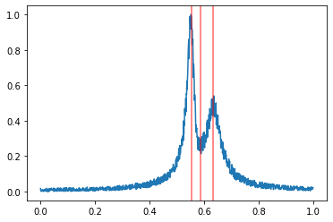
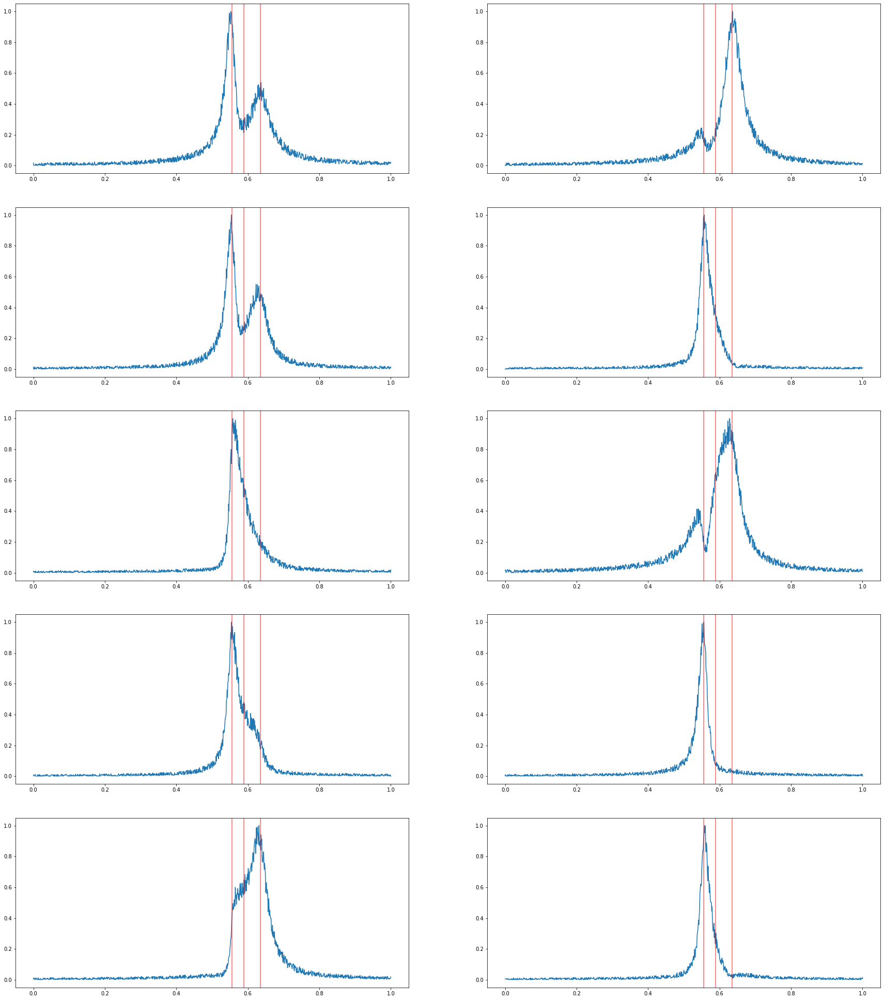

## Spectra Generator

```python
from spectra_generator import SpectraGenerator

spectra_generator = SpectraGenerator(n_max=5, nc=10, k=1, scale=1,
                 omega_shift=10)
spectrum = spectra_generator.generate_spectrum()
```

**Installation Instructions:**

*MAC OS*
1. Find your 'matlabroot'
  - Open Matlab Application
  - In command window, enter '`matlabroot`'
  - Note result (refer to as '`MATLABROOT`')
2. Open terminal (either in Jupyter or machine)
  - `cd MATLABROOT/extern/engines/python`
  - `python setup.py install`

### Spectrum Class
```python
print(spectrum.__dict__)
```
```bash
{'n': 3.0,
 'dm': array([[0.01251392, 0.00456968, 0.01145224, ..., 0.00943986, 0.00319595,
         0.        ],
        [0.00865342, 0.03238539, 0.01786775, ..., 0.00857245, 0.00197015,
         0.01237599],
        [0.01185974, 0.02244476, 0.01925143, ..., 0.02409697, 0.02539242,
         0.02539019],
        ...,
        [0.01579079, 0.04827343, 0.04617052, ..., 0.02959334, 0.02393742,
         0.03070852],
        [0.01176339, 0.01616461, 0.00817005, ..., 0.01161759, 0.00844369,
         0.0188862 ],
        [0.04805625, 0.04332528, 0.05712429, ..., 0.0041624 , 0.00204632,
         0.        ]]),
 'peak_locations': array([[0.58111839, 0.2674255 , 0.44076255]]),
 'num_channels': 10.0}
```

```python
spectrum.plot_channel(0)
```


```python
spectrum.plot_channels()
```



#### Generate Spectra
The following code will generate 100 examples.
```python
num_instances = 100
spectra_json = spectra_generator.generate_spectra_json(num_instances)
print(spectra_json)
```
```bash
[{'n': 5.0,
  'num_channels': 10.0,
  'dm': array([[0.0208269 , 0.02253892, 0.0099637 , ..., 0.00040732, 0.00389147,
          0.0002161 ],
         [0.0138599 , 0.01332543, 0.00641046, ..., 0.01726208, 0.00842159,
          0.01226382],
         [0.00267872, 0.00100615, 0.00513228, ..., 0.03412608, 0.03330579,
          0.03655875],
         ...,
         [0.01622746, 0.00373547, 0.00217178, ..., 0.00237711, 0.00412067,
          0.0064957 ],
         [0.00469209, 0.00913277, 0.00675304, ..., 0.00119695, 0.00060038,
          0.0008287 ],
         [0.0192051 , 0.01656793, 0.00655339, ..., 0.00416238, 0.00353598,
          0.0005723 ]]),
  'peak_locations': array([[0.32289244, 0.69732596, 0.56352191, 0.30887174, 0.39503351]])},
 {'n': 3.0,
  'num_channels': 10.0,
  'dm': array([[0.01251392, 0.00456968, 0.01145224, ..., 0.00943986, 0.00319595,
          0.        ],
         [0.00865342, 0.03238539, 0.01786775, ..., 0.00857245, 0.00197015,
          0.01237599],
         [0.01185974, 0.02244476, 0.01925143, ..., 0.02409697, 0.02539242,
          0.02539019],
         ...,
         [0.01579079, 0.04827343, 0.04617052, ..., 0.02959334, 0.02393742,
          0.03070852],
         [0.01176339, 0.01616461, 0.00817005, ..., 0.01161759, 0.00844369,
          0.0188862 ],
         [0.04805625, 0.04332528, 0.05712429, ..., 0.0041624 , 0.00204632,
          0.        ]]),
  'peak_locations': array([[0.58111839, 0.2674255 , 0.44076255]])},
 ...
```
